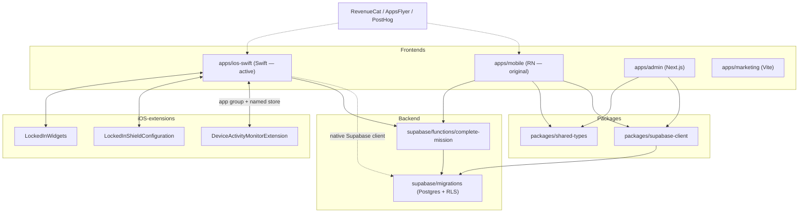

# LockedIn — Knowledge Graph

**Last mapped: 2026-06-23**

A reality-based map of this repo. Every path below was verified to exist. The code is the source of
truth — if a path here is missing when you read it, the map is stale (see Maintenance).

## What this project is

**LockedIn** is a focus / self-discipline app: users start timed "lock-in" sessions that **block
distracting apps** (iOS ScreenTime), earn **XP / streaks / ranks**, complete **missions**, and
compete in **guilds** (friend groups) on a **leaderboard**. Monetized via **RevenueCat**
subscriptions.

It's a **pnpm monorepo** with **four app surfaces** + two shared packages + a Supabase backend.
No Turbo, no CI, **no test suite** (`CLAUDE.md`).

| Surface | Path | Stack | Status |
|---|---|---|---|
| Mobile (original) | `apps/mobile` | Expo 54 / React Native 0.81 / React 19 | RN original |
| **iOS native** | `apps/ios-swift` | SwiftUI + native ScreenTime | **Active migration frontier** |
| Admin | `apps/admin` | Next.js 15 / React 19 / Tailwind | Active |
| Marketing | `apps/marketing` | Vite 6 / React 19 | Low activity |
| Shared types | `packages/shared-types` | Pure TypeScript | — |
| Supabase client | `packages/supabase-client` | `@supabase/supabase-js` | — |
| Backend | `supabase/` | Postgres + RLS + Edge Functions (Deno) | Active (24 migrations) |

> **Frontier note:** `apps/mobile` (RN) and `apps/ios-swift` (Swift) are **two parallel frontends of
> the same product**. The Swift app is the active rewrite — see `apps/ios-swift/MIGRATION_*.md` /
> `LAUNCH_GATE.md`. When they conflict, the Swift app reflects current intent for iOS.

---

## 1 — Code / Doc Hierarchy (4 tiers)

Tier 1 wins conflicts — change it on purpose.

### Tier 1 — Source of Truth (the shape of the thing)
- `supabase/migrations/` — **the data model** (24 SQL migrations; `00001_initial_schema.sql` →
  `20260613042542_recompute_rank_from_xp.sql`). **Load-bearing** — changing a table reshapes every app.
- `packages/shared-types/src/*` — cross-surface type contracts (`session.types.ts`, `stats.types.ts`,
  `scheduled-session.types.ts`, `audio-track.types.ts`, `api.types.ts`). **Load-bearing.**
- `apps/ios-swift/*.md` — the only real design/spec docs: `LAUNCH_GATE.md`,
  `MIGRATION_BACKEND_INVENTORY.md`, `MIGRATION_FRONTEND_INVENTORY.md`, `MIGRATION_DESIGN_FIDELITY.md`,
  `MIGRATION_FIDELITY_REAUDIT.md`, `NATIVE_FEATURES_ROADMAP.md`.
- `CLAUDE.md` (root) — the **visual design system** spec (colors, typography, glassmorphism, spacing).
- `apps/ios-swift/Shared/SharedScreenTimeConstants.swift` — cross-process contract (app group +
  named ManagedSettings store) shared by the app and its extensions. **Load-bearing for ScreenTime.**

### Tier 2 — Core (what everything hangs off)
- Entry points: `apps/mobile/index.ts` → `apps/mobile/src/app/App.tsx`;
  `apps/ios-swift/LockedIn/LockedInApp.swift` (`@main`) → `RootView.swift` + `AppDelegate.swift`;
  `apps/admin/app/layout.tsx` + `apps/admin/middleware.ts`; `apps/marketing/src/main.tsx`.
- Navigation: `apps/mobile/src/navigation/` (`RootNavigator.tsx`, `MainNavigator.tsx`,
  `TabNavigator.tsx`, `OnboardingNavigator.tsx`); `apps/ios-swift/LockedIn/Navigation/` (same names +
  `LockInCoordinator.swift`).
- Data access package: `packages/supabase-client/src/` (`client.ts`, `auth.ts`, `storage.ts`).

### Tier 3 — Implementation (services, clients, utilities)
- Mobile services: `apps/mobile/src/services/` (17 files: `SupabaseService.ts`, `NotificationService.ts`,
  `SubscriptionService.ts`, `AppsFlyerService.ts`, `PostHogService.ts`, `LockModeService.ts`,
  `XPService.ts`, `StatsService.ts`, `RankService.ts`, …).
- iOS services: `apps/ios-swift/LockedIn/Services/` (15 files: `SupabaseClient.swift`,
  `NotificationService.swift`, `StatsService.swift`, `XPService.swift`, `WidgetDataPublisher.swift`,
  `StorageMigrations.swift`, `Defaults.swift`, …).
- iOS ScreenTime + extensions: `apps/ios-swift/LockedIn/ScreenTime/ScreenTimeModule.swift`,
  `apps/ios-swift/DeviceActivityMonitorExtension/`, `apps/ios-swift/LockedInShieldConfiguration/`.
- Backend functions: `supabase/functions/complete-mission/index.ts`, `supabase/functions/_shared/`.
- Admin server libs: `apps/admin/lib/` (`supabase-server.ts`, `supabase-browser.ts`,
  `require-admin.ts`, `utils.ts`).

### Tier 4 — Supporting
- `apps/marketing/` (static-ish Vite site), `scripts/`, design tokens
  (`apps/mobile/src/design/`, `apps/ios-swift/Packages/DesignKit/`),
  iOS widgets `apps/ios-swift/LockedInWidgets/`.

---

## 2 — Concept Clusters (why → what → how → gotchas)

Paths point at the **iOS Swift app first** (active frontier); the RN equivalent is noted. No
dedicated design doc exists for most domains → marked `DOC: NOT FOUND`.

### Focus Session & Lock-In (the core loop)
- why → `apps/ios-swift/NATIVE_FEATURES_ROADMAP.md` (closest spec); domain DOC: NOT FOUND
- what → `apps/ios-swift/LockedIn/Features/Session/` (`SessionEngine.swift`, `ActiveSessionStore.swift`,
  `Screens/ExecutionBlockScreen.swift`) · RN: `apps/mobile/src/features/home/engine/`
- how → `apps/ios-swift/LockedIn/Features/Session/LockModeService.swift` +
  `apps/ios-swift/LockedIn/ScreenTime/ScreenTimeModule.swift` (applies the app shield)
- gotchas → wall-clock timer (survives background); `< 60s` earns 0 XP; completion fan-out lives in
  `Navigation/MainNavigator.swift` (`handleSessionFinish`), not the screen.

### Scheduled Lock-In (auto-block on a schedule) — iOS only
- why → DOC: NOT FOUND — see code
- what → `apps/ios-swift/LockedIn/Features/ScheduledSessions/` +
  `apps/ios-swift/LockedIn/Features/ScheduledSessions/ScheduledLockService.swift`
- how → `apps/ios-swift/DeviceActivityMonitorExtension/LockedInDeviceActivityMonitor.swift`
  (`intervalDidStart` applies the shield even with the app closed); shared keys in
  `apps/ios-swift/Shared/SharedScreenTimeConstants.swift`
- gotchas → background blocking depends ENTIRELY on `intervalDidStart` firing; in-app windows are
  "promoted" to a normal session in `MainNavigator.resumeScheduledLiveIfNeeded()`; crediting deduped
  by occurrence id (`ScheduledSessionsStore.markCredited`). No RN equivalent.

### Auth (anonymous-first)
- why → `packages/supabase-client/src/auth.ts` (header comment explains anon-first + reinstall risk)
- what → `apps/ios-swift/LockedIn/Features/Auth/` · RN: `apps/mobile/src/features/auth/`
  (`AuthProvider.tsx`, `AuthService.ts`)
- how → `packages/supabase-client/src/auth.ts` (`ensureAnonymousSession` → `signInAnonymously`);
  Apple Sign-In + account linking layered on top
- gotchas → device reinstall ⇒ new anonymous id ⇒ streak loss (documented in `auth.ts`).
  **Admin auth is different** — see Admin cluster.

### Streak / XP / Stats / Rank (progression)
- why → DOC: NOT FOUND — see `packages/shared-types/src/stats.types.ts` for the contract
- what → `apps/ios-swift/LockedIn/Features/Streak/`, `apps/ios-swift/LockedIn/Services/XPService.swift`,
  `StatsService.swift`, `AchievementService.swift` · RN: `apps/mobile/src/services/{XPService,StatsService,RankService}.ts`
- how → DB: `supabase/migrations/00011_user_stats.sql`, `00012_user_xp_log.sql`,
  `00013_user_achievements.sql`, `20260613042542_recompute_rank_from_xp.sql`
- gotchas → FOC XP capped 180/day; rank is recomputed from XP (latest migration); stat formulas live
  in code + migrations, not a doc.

### Missions
- what → `apps/ios-swift/LockedIn/Features/Missions/` · RN: `apps/mobile/src/features/missions/`
  (`MissionsProvider.tsx`)
- how → 3-slot recommendation engine; auto-complete checked on session finish
  (`MainNavigator.handleSessionFinish` → `missions.checkAutoComplete`)
- gotchas → mission completion also pushes guild scores (see Guilds).

### Guilds & Leaderboard (formerly "crews")
- why → `supabase/migrations/20260403045854_create_crew_system_tables.sql` +
  `20260425224615_rename_crew_to_guild.sql`
- what → `apps/ios-swift/LockedIn/Features/Leaderboard/` (incl. `GuildService.swift`) ·
  RN: `apps/mobile/src/features/leaderboard/`
- how → server-authoritative scoring: `supabase/functions/complete-mission/index.ts` →
  `upsert_guild_score` RPC
- gotchas → **crew→guild rename mid-flight**: legacy "crew" names persist in code/columns
  (e.g. `guild_scores.week_key`, `StorageMigrations.swift`). `00008_upsert_crew_score.sql` is the old
  name of the RPC.

### Subscriptions (RevenueCat)
- what → `apps/ios-swift/LockedIn/Features/Subscription/` · RN:
  `apps/mobile/src/services/SubscriptionService.ts` + `features/subscription/SubscriptionProvider.tsx`
- how → RevenueCat SDK; entitlement `Inner_Circle`; links Supabase user id + AppsFlyer id
- gotchas → `restorePurchases()` on boot handles reinstalls; iOS key only (no Android key wired).

### Onboarding
- what → `apps/ios-swift/LockedIn/Features/Onboarding/` · RN:
  `apps/mobile/src/features/onboarding/` (`state/OnboardingProvider.tsx`)
- how → `OnboardingNavigator` decides onboarding vs main; captures goal + weaknesses (feeds missions)
- gotchas → iOS onboarding includes the Family Controls (ScreenTime) permission prompt + app picker.

### Analytics & Attribution
- what/how → PostHog (`apps/mobile/src/services/PostHogService.ts` + `AnalyticsService.ts`;
  iOS `Services/AnalyticsService.swift`), AppsFlyer (`apps/mobile/src/services/AppsFlyerService.ts`)
- gotchas → event names snake_case; super-properties auto-attached; AppsFlyer id forwarded to
  RevenueCat for S2S revenue attribution.

### Admin dashboard
- what → `apps/admin/app/` (App Router; `/dashboard`, `/program`, `/api/*`)
- how → `apps/admin/middleware.ts` gates routes via Supabase SSR + `ADMIN_ALLOWED_EMAILS` allowlist;
  `apps/admin/lib/require-admin.ts` re-checks in API routes
- gotchas → **UNCLEAR / layered auth**: `apps/admin/app/layout.tsx` mounts `ClerkProvider`, but the
  actual route protection is Supabase + email allowlist + `profiles.role='admin'` RLS. The existing
  root `CLAUDE.md` calls this "Clerk auth" — that's only half true. Confirm with a human which path
  actually authenticates login before relying on it.

---

## 3 — Quick Reference (question → location)

| Question | Location |
|---|---|
| Where does the iOS app start? | `apps/ios-swift/LockedIn/LockedInApp.swift` (`@main`) → `RootView.swift` |
| Where does the RN app start? | `apps/mobile/index.ts` → `apps/mobile/src/app/App.tsx` |
| Where does the admin app start / gate? | `apps/admin/app/layout.tsx` + `apps/admin/middleware.ts` |
| Where is a focus session run? | `apps/ios-swift/LockedIn/Features/Session/SessionEngine.swift` |
| Where is scheduled lock-in handled? | `apps/ios-swift/LockedIn/Features/ScheduledSessions/` + `DeviceActivityMonitorExtension/` |
| How are apps actually blocked (shield)? | `apps/ios-swift/LockedIn/ScreenTime/ScreenTimeModule.swift` + `Shared/SharedScreenTimeConstants.swift` |
| Where is the data model / schema? | `supabase/migrations/` (start at `00001_initial_schema.sql`) |
| How is auth handled (mobile)? | `packages/supabase-client/src/auth.ts` (anonymous-first) |
| How is auth handled (admin)? | `apps/admin/middleware.ts` (Supabase SSR + `ADMIN_ALLOWED_EMAILS` + RLS) |
| Where are env keys wired (mobile)? | `apps/mobile/src/config/env.ts` (`requireEnv`, `EXPO_PUBLIC_*`) |
| Where are env keys wired (iOS)? | `apps/ios-swift/LockedIn/Services/LockedInConfig.swift` |
| Where is guild scoring computed? | `supabase/functions/complete-mission/index.ts` (`upsert_guild_score`) |
| Where do XP/streak/rank live? | `Services/XPService.*`, `StatsService.*` + `supabase/migrations/0001[1-3]_*`, `20260613…` |
| How do I run / build locally? | root `package.json` scripts (`pnpm mobile` / `pnpm admin` / `pnpm dev`); iOS: open `apps/ios-swift` via XcodeGen `project.yml` |
| How do I run tests? | NOT FOUND — no test suite configured |
| How are DB types regenerated? | `pnpm supabase:gen-types` → `packages/supabase-client/src/types.ts` (currently a stub) |

---

## 4 — Evidence Tracing (claim → code)

- Claim: "Admin route protection is a Supabase email allowlist + RLS, not Clerk."
  Code: `apps/admin/middleware.ts:4` (`ADMIN_ALLOWED_EMAILS`), `:27` (`getUser`), `:30-31` (allowlist
  check + RLS comment) — while `apps/admin/app/layout.tsx:3,29` only mounts `ClerkProvider`.
- Claim: "Mobile auth is anonymous-first."
  Code: `packages/supabase-client/src/auth.ts:23` (`signInAnonymously`).
- Claim: "DB types are a stub until generated."
  Code: `packages/supabase-client/src/types.ts:3` (`export type Database = Record<string, never>;`).
- Claim: "App + extensions share one ScreenTime store/app-group."
  Code: `apps/ios-swift/Shared/SharedScreenTimeConstants.swift:13` (app group),
  `:18` (store name `"lockedIn"`), `:28` (`scheduledActivityPrefix`).
- Claim: "A scheduled window is blocked in the background by the extension, not the app."
  Code: `apps/ios-swift/DeviceActivityMonitorExtension/LockedInDeviceActivityMonitor.swift:27,37`
  (`intervalDidStart` → `applyShieldFromSavedSelection`).
- Claim: "Scheduled windows are promoted into the normal session flow when the app is open."
  Code: `apps/ios-swift/LockedIn/Navigation/MainNavigator.swift:547`
  (`resumeScheduledLiveIfNeeded`), `:570` (`scheduledOccurrenceId`).
- Claim: "Guild scores are computed server-side."
  Code: `supabase/functions/complete-mission/index.ts:114` (`supabase.rpc('upsert_guild_score', …)`).
- Claim: "A profile + stats row is auto-created on signup."
  Code: `supabase/migrations/00001_initial_schema.sql:32` (`handle_new_user()`), `:42` (trigger).
- Claim: "Missing env vars fail fast at startup (mobile)."
  Code: `apps/mobile/src/config/env.ts:9` (`requireEnv`), `:27` (`EXPO_PUBLIC_SUPABASE_URL`).

---

## 5 — Relationship Graph

---

## 6 — Search Index (keyword → location)

- lock-in / focus session → `apps/ios-swift/LockedIn/Features/Session/` · `apps/mobile/src/features/home/engine/`
- scheduled lock-in → `apps/ios-swift/LockedIn/Features/ScheduledSessions/`
- shield / app blocking → `apps/ios-swift/LockedIn/ScreenTime/ScreenTimeModule.swift`
- DeviceActivity / intervalDidStart → `apps/ios-swift/DeviceActivityMonitorExtension/LockedInDeviceActivityMonitor.swift`
- app group / managed settings store → `apps/ios-swift/Shared/SharedScreenTimeConstants.swift`
- guild / crew (legacy) → `apps/ios-swift/LockedIn/Features/Leaderboard/` · `supabase/migrations/20260425224615_rename_crew_to_guild.sql`
- guild scoring / upsert_guild_score → `supabase/functions/complete-mission/index.ts`
- mission → `apps/ios-swift/LockedIn/Features/Missions/` · `apps/mobile/src/features/missions/`
- streak → `apps/ios-swift/LockedIn/Features/Streak/` · `supabase/migrations/00011_user_stats.sql`
- XP / rank → `apps/ios-swift/LockedIn/Services/XPService.swift` · `supabase/migrations/20260613042542_recompute_rank_from_xp.sql`
- anonymous auth → `packages/supabase-client/src/auth.ts`
- admin allowlist → `apps/admin/middleware.ts`
- Clerk → `apps/admin/app/layout.tsx` (provider only — see Admin cluster gotcha)
- RevenueCat / subscription → `apps/mobile/src/services/SubscriptionService.ts`
- AppsFlyer → `apps/mobile/src/services/AppsFlyerService.ts`
- PostHog / analytics → `apps/mobile/src/services/PostHogService.ts` · `apps/ios-swift/LockedIn/Services/AnalyticsService.swift`
- env / secrets (mobile) → `apps/mobile/src/config/env.ts`
- env / secrets (iOS) → `apps/ios-swift/LockedIn/Services/LockedInConfig.swift`
- DB types (gen-types) → `packages/supabase-client/src/types.ts`
- widgets / live activity → `apps/ios-swift/LockedInWidgets/`
- migration / roadmap docs → `apps/ios-swift/*.md`

---

## Maintenance

- Update this map when a **new feature area, service, or major file** is added or moved (especially a
  new `Features/*` folder, a new `services/*` singleton, a new migration, or a new app surface).
- **Drift check before trusting it:** confirm the cited paths still exist (e.g. grep each `path` in
  this file). If any are missing, the map is stale — fix it before relying on it.
- Re-stamp **"Last mapped"** after each update.
- The two frontends drift independently — when mapping a domain, check whether the RN and Swift sides
  still agree, and note divergences (the Swift app leads on iOS).
